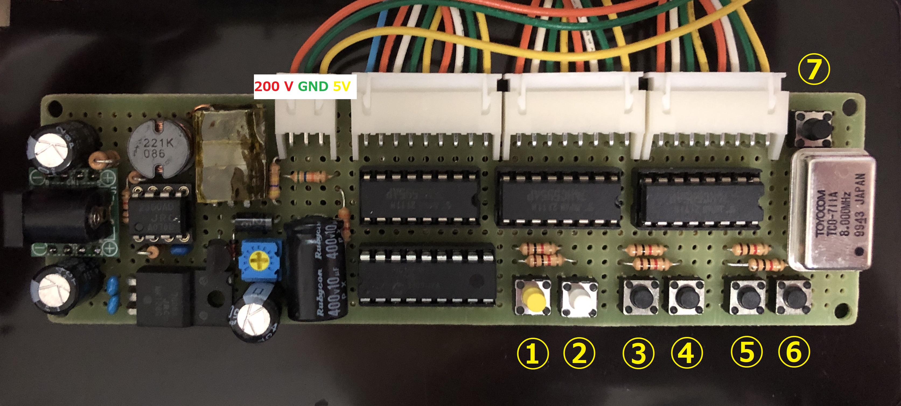

# ニキシー管時計

6桁表示のニキシー管時計です。

## ハードウェア

基板は2段構造になっており，1段目で電源，制御回路を構成し，2段目で表示数字デコード及びニキシー管の表示を行います。使用しているパーツは次の通りです。

* 1段目

  * 電源回路

    | パーツ名                                                                 | 秋月コード         | 個数 | 用途                                          | 
    | ------------------------------------------------------------------------ | ------------------ | ---- | --------------------------------------------- | 
    | ＤＣＤＣコンバーター制御用ＩＣ　ＮＪＭ２３６０ＡＤ                       | NJM2360AD          | 1    | 昇圧用IC                                      | 
    | 三端子レギュレーター　５Ｖ１．５Ａ　ＮＪＭ７８０５ＦＡ                   | NJM7805FA          | 1    | 5V生成用IC                                    | 
    | ＮｃｈパワーＭＯＳＦＥＴ　６００Ｖ１０Ａ　ＴＫ１０Ａ６０Ｄ               | TK10A60D S5Q       | 1    | 昇圧回路のスイッチング用FET                   | 
    | トランジスタ　２ＳＡ１０１５ＧＲ　５０Ｖ１５０ｍＡ                       | 2SA1015GR          | 1    | FETスイッチング用トランジスタ                 | 
    | 高耐圧高速整流用ダイオード　ＵＦ２０１０　１０００Ｖ２Ａ                 | UF2010             | 1    | 昇圧回路の出力整流用ダイオード                | 
    | 汎用小信号高速スイッチング・ダイオード　１Ｎ４１４８　１００Ｖ２００ｍＡ | 1N4148             | 1    | 昇圧回路のトランジスタ用ダイオード            | 
    | インダクター　２２０μＨ１．１Ａ　ＲＣＨ１１０ＮＰ−２２１Ｋ             | RCH110NP-221K      | 1    | 昇圧用インダクタ                              | 
    | カーボン抵抗（炭素皮膜抵抗）　１Ｗ０．２Ω                               | CFS100J0R2B        | 1    | 昇圧回路電流制限用抵抗                        | 
    | カーボン抵抗（炭素皮膜抵抗）　１／２Ｗ４７０Ω                           | CFS50J470RB        | 1    | 昇圧ICのドライバコレクタ抵抗                  | 
    | カーボン抵抗（炭素皮膜抵抗）　１／２Ｗ１ｋΩ                             | CFS50J1KB          | 1    | 昇圧ICのスイッチコレクタ抵抗                  | 
    | カーボン抵抗（炭素皮膜抵抗）　１／２Ｗ３．３ｋΩ                         | CFS50J3K3B         | 1    | FETスイッチング用トランジスタのプルダウン抵抗 | 
    | カーボン抵抗（炭素皮膜抵抗）　１／２Ｗ３．３ｋΩ                         | CFS50J3K3B         | 1    | 昇圧電圧決定用抵抗                            | 
    | カーボン抵抗（炭素皮膜抵抗）　１／２Ｗ５６ｋΩ                           | CFS50J56KB         | 1    | 昇圧電圧決定用抵抗                            | 
    | カーボン抵抗（炭素皮膜抵抗）　１／２Ｗ４７０ｋΩ                         | CFS50J470KB        | 1    | 昇圧電圧決定用抵抗                            | 
    | 半固定ボリューム　ＧＦ０６３Ｐ　１ｋΩ                                   | GF063P B102K       | 1    | 昇圧電圧決定用抵抗                            | 
    | 積層セラミックコンデンサー　３３０ｐＦ５０Ｖ                             | RDE5C1H331J0K1H03B | 1    | 昇圧ICのスイッチング周波数決定用コンデンサ    | 
    | 積層セラミックコンデンサー　０．１μＦ１００Ｖ                           | RDER72A104K1K1H03B | 3    | デカップリング                                | 
    | 電解コンデンサー　１０μＦ４００Ｖ１０５℃                               | 400PX10MEFC10X16   | 1    | 昇圧回路平滑化コンデンサ                      | 
    | 電源用電解コンデンサー１００μＦ３５Ｖ１０５℃                           | 35ZLH100MEFC6.3X11 | 3    | デカップリング                                | 

  * 制御回路

    | パーツ名                                                 | 秋月コード         | 個数 | 用途                       | 
    | -------------------------------------------------------- | ------------------ | ---- | -------------------------- | 
    | ＰＩＣマイコン　ＰＩＣ１６Ｆ１８２７−Ｉ／Ｐ             | PIC16F1827-I/P     | 1    | 時計制御用IC               | 
    | ８ビットシフトレジスタ　Ｕ７４ＨＣ５９５ＡＧ−Ｄ１６−Ｔ | U74HC595AG-D16-T   | 3    | 表示数字保持用レジスタ     | 
    | クリスタルオシレータ　８ＭＨｚ（長方形）                 | TCO-711A 8MHz      | 1    | マイコンクロック用         | 
    | タクトスイッチ 黄                                        |                    | 1    | ニキシー管点消灯スイッチ   | 
    | タクトスイッチ 白                                        |                    | 1    | モード切り替え用スイッチ   | 
    | タクトスイッチ 黒(高)                                    |                    | 1    | リセットスイッチ           | 
    | タクトスイッチ 黒(低)                                    |                    | 4    | 時間設定用スイッチ         | 
    | カーボン抵抗（炭素皮膜抵抗）　１／２Ｗ１０ｋΩ           | CFS50J10KB         | 7    | プルアップ・プルダウン抵抗 | 
    | 積層セラミックコンデンサー　０．１μＦ１００Ｖ           | RDER72A104K1K1H03B | 1    | デカップリング             | 

* 2段目

    | パーツ名                                                     | 秋月コード    | 個数 | 用途                           | 
    | ------------------------------------------------------------ | ------------- | ---- | ------------------------------ | 
    | K155ND1                                                      |               | 6    | ニキシー管ドライバ             | 
    | ＮｃｈパワーＭＯＳＦＥＴ　６００Ｖ２．５Ａ　ＴＫ３Ａ６０ＤＡ | TK3A60DAS5Q(J | 1    | ドット点灯制御                 | 
    | カーボン抵抗（炭素皮膜抵抗）　１／２Ｗ１０ｋΩ               |               | 6    | ニキシー管電流制限抵抗(数字)   | 
    | カーボン抵抗（炭素皮膜抵抗）　１／２Ｗ１0０ｋΩ              |               | 1    | ニキシー管電流制限抵抗(ドット) | 

## 操作方法

操作ボタンは以下の7つです。それぞれの名称を以下に示します。

1. スタート/ストップボタン
2. リセットボタン
3. 左ボタン
4. 右ボタン
5. プラスボタン
6. マイナスボタン
7. ハードリセットボタン

モードは現状5つあります。

### 時計

時計として使えます。完全オフラインで，電源を切るとリセットされます。操作方法は以下の通りです。

1. スタート/ストップボタン
   * 短押し ニキシー管点灯
   * 長押し ニキシー管消灯

2. リセットボタン
   * 短押し 割り当てなし
   * 長押し 時刻合わせに移行

3. 左ボタン
   * 通常時 カレンダーモードに移行
   * 時刻合わせ時 選択桁を1つ左に

4. 右ボタン
   * 通常時 ストップウォッチ(時)モードに移行
   * 時刻合わせ時 選択桁を1つ右に

5. プラスボタン
   * 通常時 割り当てなし
   * 時刻合わせ時 
     * 短押し 選択桁の数値を1つ上げる
     * 長押し 選択桁の数値を連続で上げる

6. マイナスボタン
   * 通常時 割り当てなし
   * 時刻合わせ時 
     * 短押し 選択桁の数値を1つ下げる
     * 長押し 選択桁の数値を連続で下げる

### カレンダー

時計として使えます。完全オフラインで，電源を切るとリセットされます。**現状うるう年を考慮できていません。** 操作方法は以下の通りです。

1. スタート/ストップボタン
   * 短押し ニキシー管点灯
   * 長押し ニキシー管消灯

2. リセットボタン
   * 短押し 割り当てなし
   * 長押し 日付合わせに移行

3. 左ボタン
   * 通常時 タイマーモードに移行
   * 日付合わせ時 選択桁を1つ左に

4. 右ボタン
   * 通常時 時計モードに移行
   * 日付合わせ時 選択桁を1つ右に

5. プラスボタン
   * 通常時 割り当てなし
   * 日付合わせ時 
     * 短押し 選択桁の数値を1つ上げる
     * 長押し 選択桁の数値を連続で上げる

6. マイナスボタン
   * 通常時 割り当てなし
   * 日付合わせ時 
     * 短押し 選択桁の数値を1つ下げる
     * 長押し 選択桁の数値を連続で下げる

### タイマー

タイマーです。現状時間が来ても知らせる機能はついていません。今後ブザーや点滅で知らせる機能を付けたい。

1. スタート/ストップボタン
   * 短押し 
     * 消灯時 ニキシー管点灯
     * 点灯時 スタート/ストップの切り替え **(現状バグで消灯時にこのボタンを押すと，点灯とともにスタート/ストップの切り替えも行われてしまいます。)**
   * 長押し ニキシー管消灯

2. リセットボタン
   * 短押し タイマーをリセット
   * 長押し タイマー設定に移行

3. 左ボタン
   * 通常時 ストップウォッチ(分)モードに移行
   * タイマー設定時 選択桁を1つ左に

4. 右ボタン
   * 通常時 カレンダーモードに移行
   * タイマー設定時 選択桁を1つ右に

5. プラスボタン
   * 通常時 割り当てなし
   * タイマー設定時 
     * 短押し 選択桁の数値を1つ上げる
     * 長押し 選択桁の数値を連続で上げる

6. マイナスボタン
   * 通常時 割り当てなし
   * タイマー設定時 
     * 短押し 選択桁の数値を1つ下げる
     * 長押し 選択桁の数値を連続で下げる

### ストップウォッチ(分)

00:00.00 ~ 59:59.99までを計れるタイマーです。タイマーの内容はストップウォッチ(時)とリンクしています。スタート/ストップボタンを離すまでが計測対象です。

1. スタート/ストップボタン
   * 短押し 
     * 消灯時 ニキシー管点灯
     * 点灯時 スタート/ストップの切り替え **(現状バグで消灯時にこのボタンを押すと，点灯とともにスタート/ストップの切り替えも行われてしまいます。)**
   * 長押し ニキシー管消灯

2. リセットボタン
   * 短押し ストップウォッチをリセット
   * 長押し 割り当てなし

3. 左ボタン
   * ストップウォッチ(時)モードに移行

4. 右ボタン
   * タイマーモードに移行

5. プラスボタン
   * 割り当てなし

6. マイナスボタン
   * 割り当てなし

### ストップウォッチ(時)

00:00:00 ~ 23:59.59までを計れるタイマーです。タイマーの内容はストップウォッチ(分)とリンクしています。スタート/ストップボタンを離すまでが計測対象です。

1. スタート/ストップボタン
   * 短押し 
     * 消灯時 ニキシー管点灯
     * 点灯時 スタート/ストップの切り替え **(現状バグで消灯時にこのボタンを押すと，点灯とともにスタート/ストップの切り替えも行われてしまいます。)**
   * 長押し ニキシー管消灯

2. リセットボタン
   * 短押し ストップウォッチをリセット
   * 長押し 割り当てなし

3. 左ボタン
   * 時計モードに移行

4. 右ボタン
   * ストップウォッチ(分)モードに移行

5. プラスボタン
   * 割り当てなし

6. マイナスボタン
   * 割り当てなし